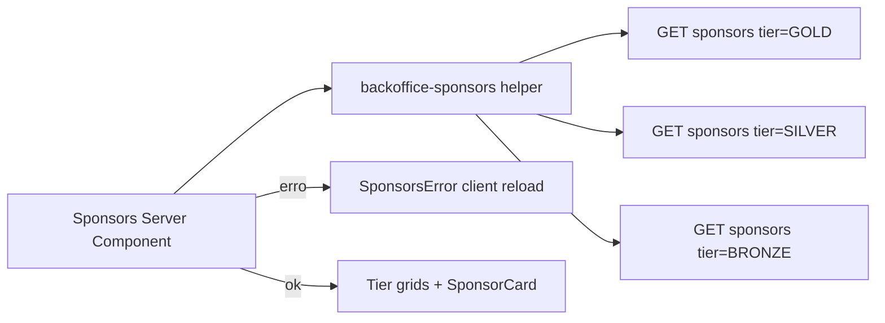

# Integração da seção Patrocinadores com API do backoffice

## Contexto da API

- Endpoint: `[GET /v1/public/sponsors](.cursor/rules/api-docs/api-endpoints.yml)` — público, sem JWT.
- Query params: `tier` (`BRONZE` | `SILVER` | `GOLD`), `page`, `size` ([linhas 1588–1608](.cursor/rules/api-docs/api-endpoints.yml)).
- Resposta: envelope `EnvelopePublicSponsorListDTO`; itens são `PublicSponsorItemDTO` com estrutura aninhada `user` → `sponsor` ([schemas](.cursor/rules/api-docs/api-endpoints.yml): `PublicSponsorUserDTO`, `PublicSponsorDataDTO`).
- Campos úteis para a landing: `user.sponsor.publicName`, `logoUrl`, `site`, `instagram`, `tier`; para “últimos adicionados”: `user.createdAt` ([regra de negócio](.cursor/rules/business-rule-backoffice/api-publica-patrocinadores.mdc)).

## Variável de ambiente

- Adicionar `**NEXT_PUBLIC_BACKOFFICE_API_URL**` (mesmo padrão de `[NEXT_PUBLIC_STRAPI_URL](src/lib/strapi.ts)` — valor inicial documentado `**http://localhost:8080**`, sem barra final).
- Montar URL: `${base}/v1/public/sponsors?tier=GOLD&page=1&size=10` (e o análogo para `SILVER` / `BRONZE`).
- **Nota:** com `NEXT_PUBLIC_` a URL fica exposta ao browser; é aceitável para uma rota pública. Se preferirem não expor a base, dá para trocar depois por variável só de servidor e manter o fetch em Server Component (o fluxo abaixo continua válido).

## Busca de dados e ordenação

- Implementar um helper (ex.: `[src/lib/backoffice-sponsors.ts](src/lib/backoffice-sponsors.ts)`) que:
  - Faz **3 `fetch` em paralelo** (`Promise.all`) com `tier` GOLD, SILVER e BRONZE.
  - Usa `cache: 'no-store'` (ou `revalidate` curto, conforme preferência de freshness) para a landing refletir novos patrocinadores sem depender de mock.
  - Valida HTTP ok e, se o envelope tiver `status === 'ERROR'`, trata como falha.
  - **Ordenação:** o OpenAPI não especifica ordem; após receber `data`, ordenar por `user.createdAt` **decrescente** para garantir os 10 mais recentes por tier (limitados por `size=10`).
- Mapear `SponsorTierEnum` da API (`GOLD` etc.) para as chaves já usadas no UI (`gold` | `silver` | `bronze`) em `[tierConfig](src/components/sections/sponsors.tsx)`.

## UI: cards e links

- Atualizar o card para:
  - **Logo:** `` com fallback amigável se `logoUrl` ausente ou `onError` (evita depender de `remotePatterns` do Next para CDNs desconhecidos; o projeto já usa `[images.unoptimized: true](next.config.ts)`).
  - **Nome:** `publicName` (não o mock `name`).
  - **Site:** link para `site` quando existir (mesmo padrão `target="_blank"` + `rel`).
  - **Instagram:** se `instagram` existir, normalizar para URL (se vier só handle/`@user`, montar `https://www.instagram.com/.../`; se já for URL, usar como está).

## Tratamento de erro

- Tornar o bloco principal da seção **async Server Component** (ou extrair `SponsorsContent` async importado por um shell leve) que chama o helper.
- Se qualquer uma das 3 requisições falhar (rede, não-JSON, envelope de erro): renderizar um **componente cliente** pequeno (ex.: `sponsors-error.tsx` com `"use client"`) com mensagem clara e botão **“Tentar novamente”** que chama `window.location.reload()` (como pedido).

## Limpeza de escopo

- Remover import de `[sponsors` de `@/lib/data](src/components/sections/sponsors.tsx)` nesta seção.
- **Fora do escopo imediato** (a menos que queira alinhar tudo agora): `[gold-sponsors-carousel.tsx](src/components/sections/article-page/gold-sponsors-carousel.tsx)`, `[gold-sponsors-sidebar.tsx](src/components/sections/news-page/gold-sponsors-sidebar.tsx)` ainda usam mock — podem continuar com mock ou ser um follow-up com a mesma API filtrando `tier=GOLD`.

## Tipos

- Tipar o JSON mínimo necessário (envelope + `user.sponsor`) em um ficheiro dedicado ou junto do helper; não é obrigatório alterar `[Sponsor](src/types/entities/index.ts)` se o componente usar um tipo específico “API → card” e assim evitar misturar mock com DTO.

